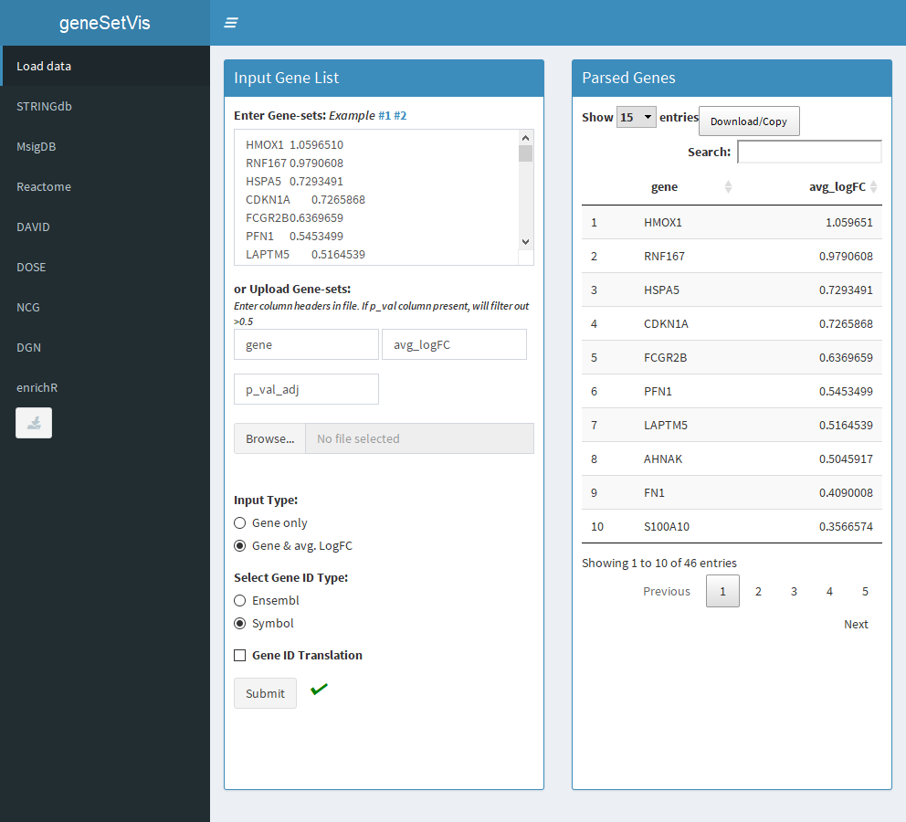
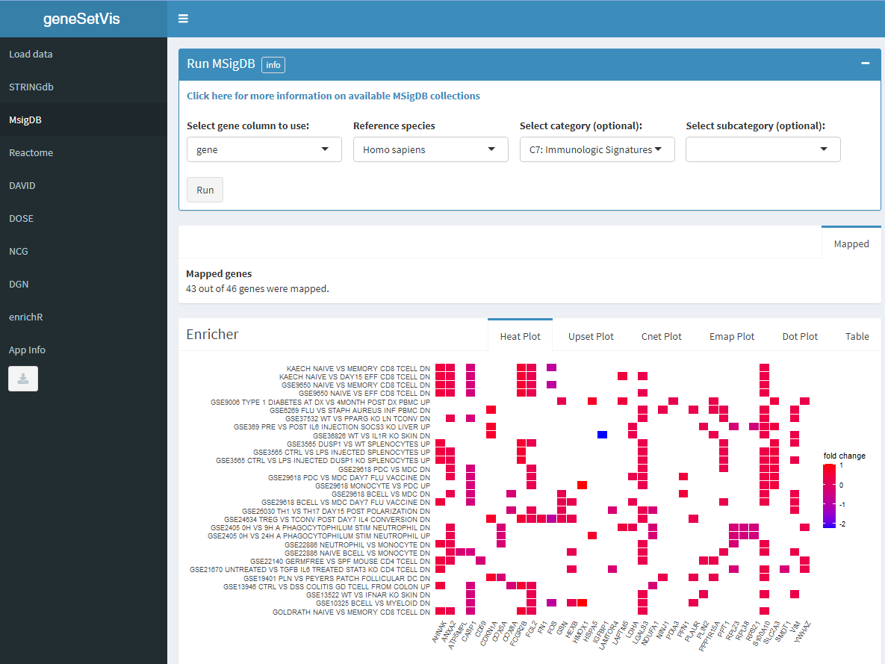

# geneSetVis

geneSetVis is a shiny app for the visualization of enrichment analysis of sets of genes.

## Table of Contents
* [Overview](#overview)
* [Usage](#usage)
* [Installation](#installation)
* [Data Sources](#dataSources)

### <a name="overview">Overview</a>

Interpreting the results of transcriptomic analysis generally requires interrogating the function of lists of genes. There are many databases designed to provide gene functional or pathway annotation, and many provide APIs to query their data. geneSetVis takes advantage of these, providing a single interactive Shiny app where the user can enter a set of genes once, and query a variety of these sources. We take advantage of the [enrichplot package](https://bioconductor.org/packages/release/bioc/html/enrichplot.html) to provide a set of consistent visualizations from most data sources. This is designed as an exploratory tool, not to produce publication-level analysis.  

### <a name="usage">Usage</a>

To begin, simply enter you list of genes, either with gene symbols only or as a tab-separated list of gene and fold-change:



After genes are entered, you can select from different data sources (tabs at the left ). Per data source, you can choose from other options/databases, and then view the results as a table or generate different plots:



### <a name="installation">Installation</a>

```
# Install package:
devtools::install_github("bimberlabinternal/geneSetVis", dependencies = TRUE)

# Launch app:
geneSetVis::launchGeneSetVis()
```

### <a name="dataSources">Data Sources</a>

The following databases are used by geneSetVis:

- [DAVID](https://david.ncifcrf.gov/) and the [RDAVIDWebservice R package](http://bioconductor.org/packages/release/bioc/html/RDAVIDWebService.html)
- [DisGeNET](https://www.disgenet.org/) via the [DOSE R package](https://www.bioconductor.org/packages/release/bioc/html/DOSE.html)
- [DOSE (Disease Ontology Semantic and Enrichment)](https://www.bioconductor.org/packages/release/bioc/html/DOSE.html)
- [MSigDB](https://www.gsea-msigdb.org/gsea/msigdb) and the [msigdbr R package](https://cran.r-project.org/web/packages/msigdbr/vignettes/msigdbr-intro.html)
- [NCG (Network of Canger Genes)](http://ncg.kcl.ac.uk/)
- [Reactome Pathway Analysis](https://reactome.org/PathwayBrowser/) and the [ReactomePA R package](https://bioconductor.org/packages/release/bioc/html/ReactomePA.html) 
- [STRINGdb](https://string-db.org/) and the [STRINGdb R package](http://www.bioconductor.org/packages/release/bioc/html/STRINGdb.html)

